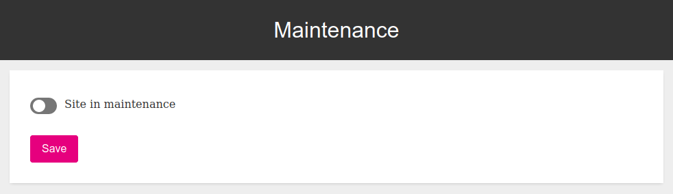
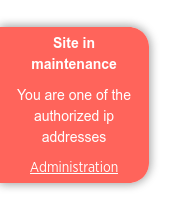

[](https://packagist.org/packages/rich-id/maintenance-bundle)
[](https://github.com/rich-id/maintenance-bundle/actions)
[](https://coveralls.io/github/rich-id/maintenance-bundle?branch=master)
[](https://codeclimate.com/github/rich-id/maintenance-bundle/maintainability)


[](https://github.com/rich-id/maintenance-bundle/issues)
[](LICENSE)

# Table of content

1. [Installation](#1-installation)
2. [Usage](#2-usage)
3. [Versioning](#3-versioning)
4. [Contributing](#4-contributing)
5. [Hacking](#5-hacking)
6. [License](#6-license)

# 1. Installation

This version of the bundle requires Symfony 4.4+ and PHP 7.3+. Moreover, remember to properly configure the [lexik/maintenance-bundle](https://packagist.org/packages/lexik/maintenance-bundle).

### 1.1 Composer

```bash
composer require rich-id/maintenance-bundle
```

### 1.2 Bundles declaration

After the installation, make sure that the bundle are declared correctly within the Kernel's bundles list. This should be done automatically if you use Symfony Flex.

```php
return [
    // ...
   Lexik\Bundle\MaintenanceBundle\LexikMaintenanceBundle::class => ['all' => true],
   RichId\MaintenanceBundle\Infrastructure\RichIdMaintenanceBundle::class => ['all' => true],
];
```


## 1.3 Mandatory configuration


```yaml
rich_id_maintenance:
    resource: "@RichIdMaintenanceBundle/Resources/config/routing/routing.xml"
```

You must also configure the [lexik/maintenance-bundle](https://packagist.org/packages/lexik/maintenance-bundle). Please checkout the [Lexik maintenance bundle documentation](https://github.com/lexik/LexikMaintenanceBundle/blob/master/Resources/doc/index.md).


# 2. Usage

The bundle generates a back-office page accessible to the role `ROLE_MAINTENANCE_ADMIN` on the `/administration/maintenance` url.



You can also integrate a flag on your site displayed when the site is under maintenance, and the user is on the list of authorised IP addresses. This lets the authorised user to still use the website while in maintenance, but to remind that nobody can access it.

```html

```




# 3. Versioning

tour-bundle follows [semantic versioning](https://semver.org/). In short the scheme is MAJOR.MINOR.PATCH where
1. MAJOR is bumped when there is a breaking change,
2. MINOR is bumped when a new feature is added in a backward-compatible way,
3. PATCH is bumped when a bug is fixed in a backward-compatible way.

Versions bellow 1.0.0 are considered experimental and breaking changes may occur at any time.


# 4. Contributing

Contributions are welcomed! There are many ways to contribute, and we appreciate all of them. Here are some of the major ones:

* [Bug Reports](https://github.com/rich-id/maintenance-bundle/issues): While we strive for quality software, bugs can happen, and we can't fix issues we're not aware of. So please report even if you're not sure about it or just want to ask a question. If anything the issue might indicate that the documentation can still be improved!
* [Feature Request](https://github.com/rich-id/maintenance-bundle/issues): You have a use case not covered by the current api? Want to suggest a change or add something? We'd be glad to read about it and start a discussion to try to find the best possible solution.
* [Pull Request](https://github.com/rich-id/maintenance-bundle/merge_requests): Want to contribute code or documentation? We'd love that! If you need help to get started, GitHub as [documentation](https://help.github.com/articles/about-pull-requests/) on pull requests. We use the ["fork and pull model"](https://help.github.com/articles/about-collaborative-development-models/) were contributors push changes to their personal fork and then create pull requests to the main repository. Please make your pull requests against the `master` branch.

As a reminder, all contributors are expected to follow our [Code of Conduct](CODE_OF_CONDUCT.md).


# 5. Hacking

You might use Docker and `docker-compose` to hack the project. Check out the following commands.

```bash
# Start the project
docker-compose up -d

# Install dependencies
docker-compose exec application composer install

# Run tests
docker-compose exec application bin/phpunit

# Run a bash within the container
docker-compose exec application bash
```


# 6. License

maintenance-bundle is distributed under the terms of the MIT license.

See [LICENSE](LICENSE) for details.
